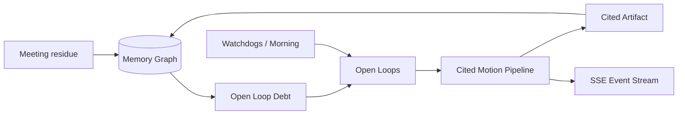

# Continuum — Open Loop OS

**Memory that moves. Debt you can burn.**

Continuum bridges long-term AI **Memory** with autonomous **Motion** by measuring and closing **Open Loop Debt** — unfinished work that chat logs forget and agents rarely finish.

Built for [Memory Meets Motion](https://luma.com/iu9svaun).


> Durable team memory → Cited Motion agents that close real work → results written back into the graph → Open Loop Debt goes down.

---

## The idea

| Theme | Continuum |
| --- | --- |
| Long-term AI context (Memory) | Property graph of people, projects, decisions, artifacts, and open loops |
| Autonomous agentic execution (Motion) | RocketRide-compatible `close-open-loop` pipeline |
| Stateful AI | Every run writes back artifacts + close edges; debt metrics update live |
| Trust | **Cited Motion** — every artifact lists memory node IDs/titles |
| Proactivity | Watchdogs simulate LaserData-style triggers (stale / due-soon / revenue) |

### Open Loop Debt

```text
score ≈ priorityWeight × ageFactor × dollarFactor × dueBoost
```

The command center shows open-loop debt score (before → after), dollars at risk, hours trapped, and lifetime debt burned. Seed data includes an Acme Health renewal carrying **$220k ARR** so the impact is visible immediately.

---

## Quick start

```bash
npm install
npm run dev
```

Open **http://localhost:3000**

### Demo path (~90 seconds)

1. Landing — Continuum as Open Loop OS  
2. `/app` — Open Loop Debt dashboard (note $ at risk)  
3. Click **Close My Morning** (or close the Acme renewal brief)  
4. `/app/runs` — Cited Motion steps + artifact with `## Citations`  
5. Debt drops; loop status → closed; artifact appears in the graph  
6. Optional: **Watchdogs → Scan now** or **Ingest residue** on `/app/loops`

---

## Product surface

| Route | Purpose |
| --- | --- |
| `/` | Brand landing |
| `/app` | Debt dashboard · graph · watchdogs · Close My Morning |
| `/app/memory` | Interactive graph · filter · add memory |
| `/app/loops` | Loop inbox · residue ingest |
| `/app/runs` | Live runs · steps · citations · debt delta |
| `/app/settings` | Integrations · reset seed |

### APIs

| Endpoint | Purpose |
| --- | --- |
| `GET /api/metrics` | Open Loop Debt metrics |
| `GET/PATCH/POST /api/watchdogs` | List / toggle / Scan now |
| `POST /api/morning` | Close My Morning (top 1–2 by debt) |
| `GET/POST /api/runs` | Motion runs |
| `GET/POST /api/memory` | Graph snapshot / create / reset |
| `POST /api/ingest` | Residue → event + open loop |
| `GET /api/events?runId=` | SSE telemetry |
| `GET /api/search` | Memory search |

---

## Architecture

Full narrative + diagrams: [`docs/ARCHITECTURE.md`](./docs/ARCHITECTURE.md)



Sponsor-aligned surfaces: **FalkorDB** (graph) · **RocketRide** (pipeline JSON) · **Linkup** (live context) · **LaserData** (watchdog/event triggers). Guild/Snyk are natural extension points for eval and security.

---

## Stack

Next.js 16 · TypeScript · Tailwind 4 · Framer Motion · React Flow · local JSON graph store (FalkorDB-ready)

---

## Pitch materials

- Deck: [`slides/Continuum-Memory-Meets-Motion.pptx`](./slides/Continuum-Memory-Meets-Motion.pptx)
- 3-min storyboard: [`docs/PRESENTATION.md`](./docs/PRESENTATION.md)
- External LLM prompts (pitch / Q&A / social): [`HELP_FROM_CHATGPT.md`](./HELP_FROM_CHATGPT.md)

```bash
npm run slides   # regenerate PowerPoint
```

---

## License

MIT © 2026 Continuum / Memory Meets Motion
