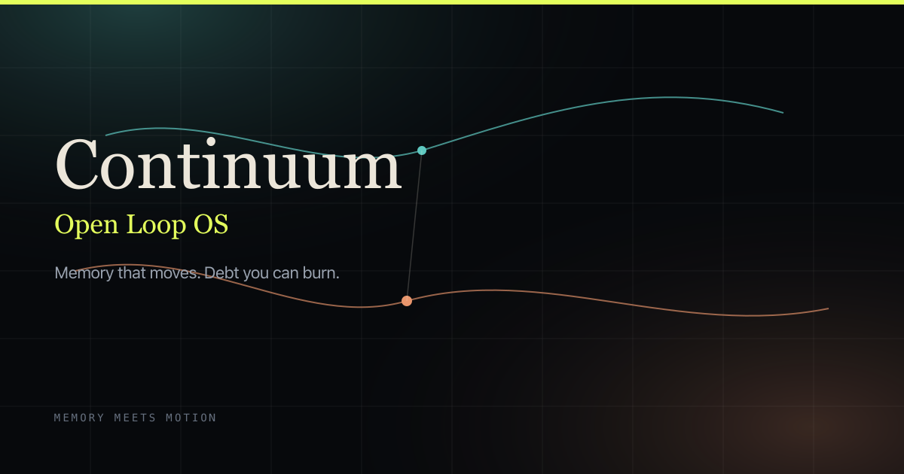
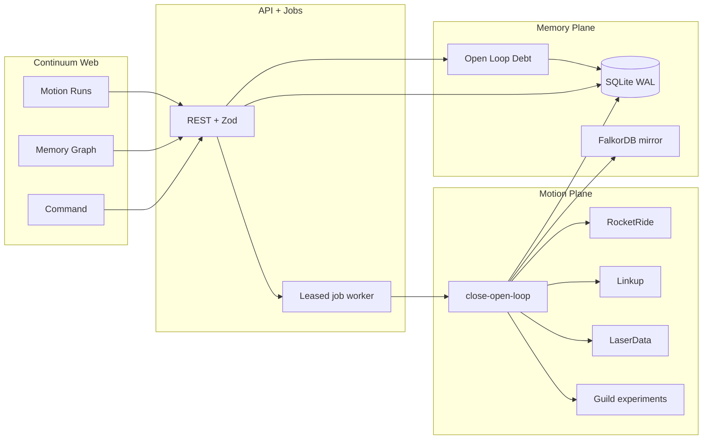

<div align="center">

# Continuum

### The Open Loop OS

**Memory that moves. Debt you can burn.**

[](https://continuum-memory-meets-motion.vercel.app)
[](https://github.com/vnmoorthy/continuum-memory-meets-motion/actions)
[](./LICENSE)
[](https://nextjs.org/)
[](https://www.typescriptlang.org/)

[Live Product](https://continuum-memory-meets-motion.vercel.app) ·
[Architecture](./docs/ARCHITECTURE.md) ·
[3‑min Pitch](./docs/PRESENTATION.md) ·
[Demo Video Script](./docs/DEMO_VIDEO.md) ·
[Deck (PPTX)](./slides/Continuum-Memory-Meets-Motion.pptx) ·
[Contributing](./CONTRIBUTING.md)

<br/>



<sub>Built for <a href="https://luma.com/iu9svaun">Memory Meets Motion</a> — Agentic Workflows & Stateful AI</sub>

</div>

---

## Why Continuum exists

Organizations don’t fail because they lack notes.  
They fail because **unfinished work compounds** — meetings without owners, Friday briefs that never ship, renewals that quietly slip.

We call that **Open Loop Debt**.

| Most AI today | Continuum |
| --- | --- |
| Remembers fragments in a chat log | Durable **graph memory** of people, projects, decisions |
| Drafts text and stops | **Cited Motion** that closes the loop |
| Can’t show impact | **Open Loop Debt** score + unique **$ at risk** |
| Forgets what it just did | **Write-back** — artifacts & edges return to memory |

> Continuum is not another chatbot.  
> It’s the substrate that makes **Memory meet Motion**.

---

## 90‑second wow path

1. Open the [live demo](https://continuum-memory-meets-motion.vercel.app) → **Enter**
2. On **Command**, find **Open Loop Debt** and **$ at risk** (Acme Health **$220k** in seed)
3. Click **Close My Morning**
4. Open the run → scroll to **`## Citations`**
5. Watch debt **before → after** as the loop closes and the brief lands in the graph

```bash
npm ci && npm run dev
# → http://localhost:3000
```

---

## Product surface

| Route | What you get |
| --- | --- |
| [`/`](https://continuum-memory-meets-motion.vercel.app/) | Full‑bleed brand landing |
| [`/app`](https://continuum-memory-meets-motion.vercel.app/app) | Debt dashboard · live graph · watchdogs · Close My Morning |
| [`/app/memory`](https://continuum-memory-meets-motion.vercel.app/app/memory) | Interactive memory graph |
| [`/app/loops`](https://continuum-memory-meets-motion.vercel.app/app/loops) | Open loop inbox · residue ingest |
| [`/app/runs`](https://continuum-memory-meets-motion.vercel.app/app/runs) | Motion runs · steps · citations · debt delta |
| [`/app/settings`](https://continuum-memory-meets-motion.vercel.app/app/settings) | Sponsor SDK status · DEMO honesty · reset seed |

---

## Architecture



Deep dive: [`docs/ARCHITECTURE.md`](./docs/ARCHITECTURE.md) · ADR: [`docs/adr/001-audit-hardening.md`](./docs/adr/001-audit-hardening.md)

---

## Sponsor SDKs — installed & invoked

Every Memory Meets Motion sponsor client is in the tree. Without keys, adapters stay **honestly DEMO**. With keys, the same code paths go live.

| Sponsor | Package | Role |
| --- | --- | --- |
| **RocketRide** | `rocketride` | Submit `pipelines/close-open-loop.json` |
| **FalkorDB** | `falkordb` | Mirror nodes/edges via OpenCypher |
| **Linkup** | `linkup-sdk` | Live web research during Motion |
| **LaserData** | `@laserdata/laser-sdk` | Durable Motion / watchdog events |
| **Guild.ai** | `@guildai/cli` + `.guild/` | Experiment records per run |
| **Snyk** | `snyk` | Dependency security scans |

Status UI: **Settings** · API: `GET /api/sponsors`

---

## Hardened by design

| Invariant | Behavior |
| --- | --- |
| Concurrent runs | ≤1 active run / loop · `Idempotency-Key` · `409` on conflict |
| Validation | Zod on bodies & persisted entities · bad `tags` → `422` |
| Jobs | Durable rows + leases · crash recovery |
| Persistence | SQLite WAL transactions · **no silent reseed** on corruption |
| Auth | Signed httpOnly demo session · workspace isolation |
| Accounting | `risk_entities` — Acme **$220k counted once** (never $440k) |
| Honesty | DEMO labels on simulated research / notify / metrics |

---

## Quick start

```bash
git clone https://github.com/vnmoorthy/continuum-memory-meets-motion.git
cd continuum-memory-meets-motion
npm ci
cp .env.example .env.local   # optional sponsor keys
npm run dev
```

**Node 20–24** · see `package.json` → `engines`

### Scripts

```bash
npm run dev          # local app
npm run build        # production build
npm run typecheck
npm test             # vitest (incl. concurrency + sponsors)
npm run test:e2e     # playwright smoke
npm run slides       # regenerate PPTX
npm run snyk:test    # security scan
npm run ci           # lint + types + tests + build
```

Env reference: [`.env.example`](./.env.example)

---

## Pitch kit

| Asset | Link |
| --- | --- |
| 10‑slide deck | [`slides/Continuum-Memory-Meets-Motion.pptx`](./slides/Continuum-Memory-Meets-Motion.pptx) |
| 3‑min spoken storyboard | [`docs/PRESENTATION.md`](./docs/PRESENTATION.md) |
| 3‑min **demo video** shot list | [`docs/DEMO_VIDEO.md`](./docs/DEMO_VIDEO.md) |
| Architecture | [`docs/ARCHITECTURE.md`](./docs/ARCHITECTURE.md) |
| Audit before/after | [`docs/AUDIT_BEFORE_AFTER.md`](./docs/AUDIT_BEFORE_AFTER.md) |

---

## Project layout

```text
continuum/
├── src/app              # Next.js App Router (UI + API)
├── src/components       # Landing, shell, graph, debt, watchdogs
├── src/lib
│   ├── motion/          # Cited Motion runtime
│   ├── sponsors/        # RocketRide · FalkorDB · Linkup · Laser · Guild · Snyk
│   ├── store/           # SQLite WAL + migrations
│   └── jobs/            # Leased worker
├── pipelines/           # close-open-loop.json
├── docs/                # Architecture, ADR, pitch script
├── slides/              # Hackathon deck
└── tests/ + e2e/        # Vitest + Playwright
```

---

## Contributing

We welcome PRs that reduce Open Loop Debt — features, hardening, docs, design.

- [CONTRIBUTING.md](./CONTRIBUTING.md)
- [CODE_OF_CONDUCT.md](./CODE_OF_CONDUCT.md)
- [SECURITY.md](./SECURITY.md)

```text
★ Star this repo if Memory should move — not just recall.
```

---

## License

[MIT](./LICENSE) © 2026 [vnmoorthy](https://github.com/vnmoorthy)

<div align="center">
  <br/>
  <sub>Close the loop.</sub>
</div>
