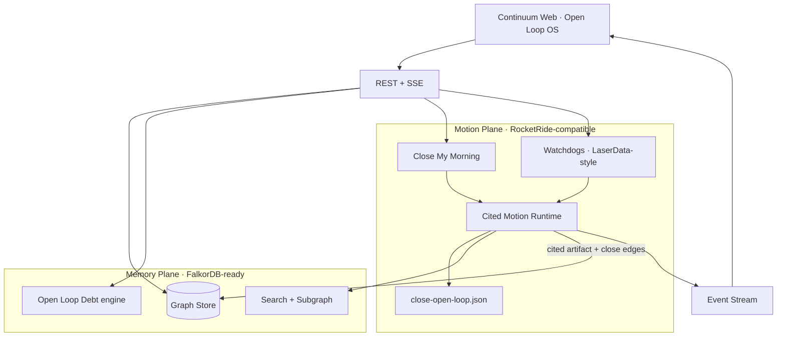
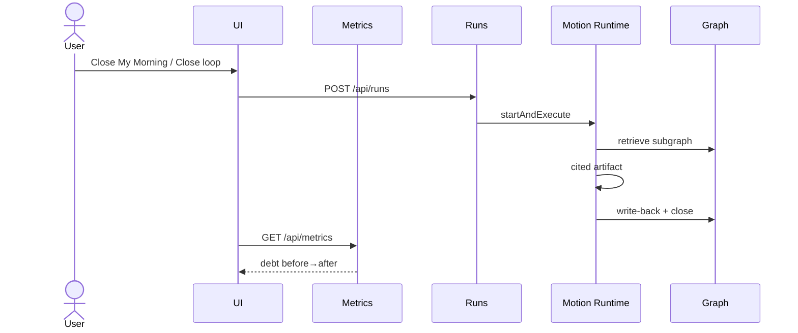

# Continuum Architecture — Open Loop OS

## Thesis

**Open Loop Debt** is unfinished organizational work that accumulates in meetings, Slack, and docs. Continuum:

1. Stores durable **Memory** as a property graph  
2. Surfaces unfinished work as **open loops** with a measurable debt score  
3. Runs **Cited Motion** pipelines that produce deliverables grounded in memory nodes  
4. **Writes back** results so the world model and debt metrics update  

## System diagram



## Open Loop Debt

Implemented in `src/lib/debt.ts` and exposed at `GET /api/metrics`.

```text
priorityWeight = 6 - priority          # P1 → 5
ageFactor      = 1 + min(ageDays,10)*0.35
dollarFactor   = 1 + log10(1 + $/1000)
dueBoost       = 1.35 if due < 48h
score          = priorityWeight × ageFactor × dollarFactor × dueBoost × 10
```

Seed impact: Acme Health renewal carries **$220k ARR** metadata so dollars at risk are visible immediately in the command center.

## Cited Motion

`src/lib/motion/runtime.ts` attaches `Citation[]` from the retrieved subgraph and appends:

```markdown
## Citations
- [person] **Maya Chen** (`person-maya`)
…
```

Inline references use `[[Title|nodeId]]` in artifact bodies.

## Watchdogs

`src/lib/watchdogs.ts` + `POST /api/watchdogs`:

| Rule | Trigger |
| --- | --- |
| `stale` | Open loop age ≥ 36h |
| `due_soon` | Due within 48h |
| `high_priority` | P1/P2 open (optional) |
| `revenue_risk` | ≥ $100k linked ARR |

Scan now can auto-queue up to 2 Motion runs (`trigger: "watchdog"`).

## Close My Morning

`POST /api/morning` ranks open loops by debt score and starts the top 1–2 (`trigger: "morning"`).

## Pipeline portability

`pipelines/close-open-loop.json` mirrors RocketRide node-graph semantics (retrieve → reason → live_context → act → writeback → stream). The local runtime executes the same steps offline so the demo stays reliable without cloud dependencies.

## Sequence: close a loop



## Extension points

- Swap JSON store for **FalkorDB** using Cypher helpers in `src/lib/memory/graph.ts`
- Execute pipeline JSON on **RocketRide Cloud**
- Replace research stub with **Linkup**
- Persist watchdog hits to **LaserData / Iggy** streams
- Track evals with **Guild.ai**; scan deps with **Snyk**
