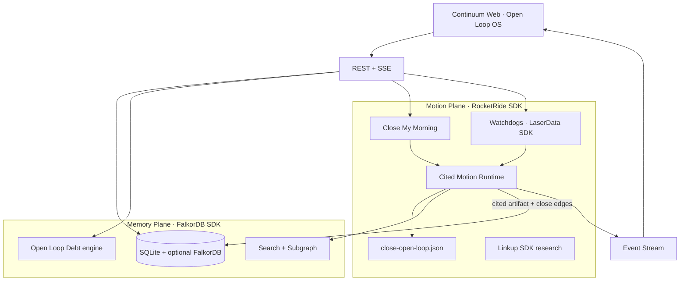
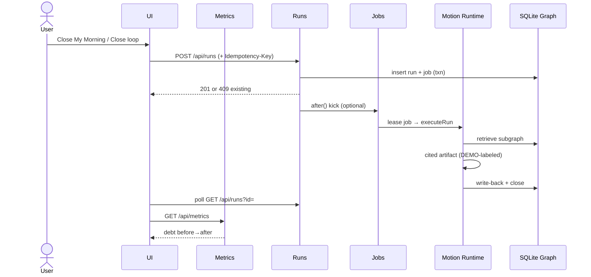

# Continuum Architecture — Open Loop OS

## Thesis

**Open Loop Debt** is unfinished organizational work that accumulates in meetings, Slack, and docs. Continuum:

1. Stores durable **Memory** as a property graph  
2. Surfaces unfinished work as **open loops** with a measurable debt score  
3. Runs **Cited Motion** pipelines that produce deliverables grounded in memory nodes  
4. **Writes back** results so the world model and debt metrics update  

## Sponsor SDK wiring

Continuum **imports and invokes** each Memory Meets Motion sponsor client:

| Sponsor | Package | Used for |
| --- | --- | --- |
| RocketRide | `rocketride` | Submit `close-open-loop` pipeline when `ROCKETRIDE_APIKEY` set; else local worker |
| FalkorDB | `falkordb` | Mirror nodes/edges via OpenCypher when `FALKORDB_HOST` set |
| Linkup | `linkup-sdk` | Live web research in Motion tool step when `LINKUP_API_KEY` set |
| LaserData | `@laserdata/laser-sdk` | Publish Motion/watchdog events to Iggy streams; JSONL fallback |
| Guild.ai | `@guildai/cli` + `.guild/continuum-runs` | Experiment records per Motion completion |
| Snyk | `snyk` | `npm run snyk:test` + Settings “Run Snyk scan” |

Status API: `GET /api/sponsors`. Without credentials, adapters report `not_configured` / DEMO and never invent live delivery.

## System diagram



## Persistence & jobs (post-audit)

- **Store:** SQLite WAL (`better-sqlite3`) under `data/continuum.sqlite` (override with `CONTINUUM_DB_PATH`).
- **Isolation:** Signed demo session cookie → `workspace_id` on all rows.
- **Jobs:** `jobs` table with lease ownership + expiry; startup recovery re-queues expired leases. Next.js `after()` only kicks the in-process worker — it is not the durability mechanism.
- **Runs:** Partial unique index enforces ≤1 `queued|running` run per `(workspace_id, loop_id)`.
- **Corruption:** `integrity_check` on open; refuse silent reseed (`DatastoreCorruptError`).
- **Multi-instance:** Demo profile is single-process. Production multi-user requires Postgres (`DATABASE_URL`) — not implemented here; do not horizontally scale SQLite.

See [`docs/adr/001-audit-hardening.md`](./adr/001-audit-hardening.md).

## Open Loop Debt

Implemented in `src/lib/debt.ts` and exposed at `GET /api/metrics`.

```text
priorityWeight = 6 - priority          # P1 → 5
ageFactor      = 1 + min(ageDays,10)*0.35
dollarFactor   = 1 + log10(1 + $/1000)
dueBoost       = 1.35 if due < 48h
score          = priorityWeight × ageFactor × dollarFactor × dueBoost × 10
```

Portfolio **dollars at risk** use unique `risk_entities` (Acme renewal `$220k` counted once even when multiple loops reference it). Seed total open risk ≈ **$268k** ($220k + $48k pilot).

## Cited Motion

`src/lib/motion/runtime.ts` attaches `Citation[]` from the retrieved subgraph and appends:

```markdown
## Citations
- [person] **Maya Chen** (`person-maya`)
…
```

In DEMO mode, research findings and notify steps are explicitly labeled as simulated — not live web grounding or outbound delivery.

## Watchdogs

`src/lib/watchdogs.ts` + `POST /api/watchdogs`:

| Rule | Trigger |
| --- | --- |
| `stale` | Open loop age ≥ 36h |
| `due_soon` | Due within 48h |
| `high_priority` | P1/P2 open (optional) |
| `revenue_risk` | ≥ $100k linked ARR |

Scan now can auto-queue up to 2 Motion runs (`trigger: "watchdog"`).

## Close My Morning

`POST /api/morning` ranks open loops by debt score and starts the top 1–2 (`trigger: "morning"`).

## Pipeline portability

`pipelines/close-open-loop.json` mirrors RocketRide node-graph semantics (retrieve → reason → live_context → act → writeback → stream). The local runtime executes the same steps offline so the demo stays reliable without cloud dependencies. DEMO mode never claims live Linkup/RocketRide execution.

## Sequence: close a loop



## Extension points

- Swap SQLite for **Postgres** / **FalkorDB** using the same Zod contracts + workspace_id
- Execute pipeline JSON on **RocketRide Cloud** under `CONTINUUM_MODE=connected`
- Replace research stub with **Linkup** when credentials exist
- Persist watchdog hits to **LaserData / Iggy** streams
- Track evals with **Guild.ai**; scan deps with **Snyk**
